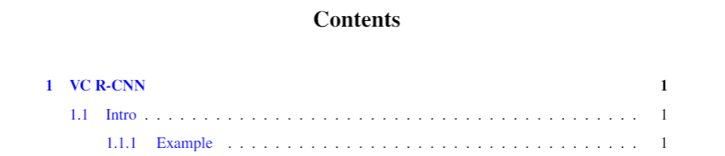
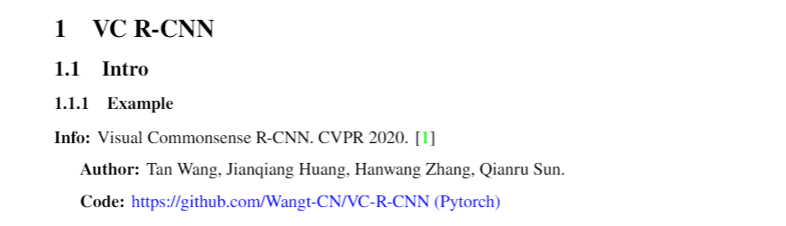
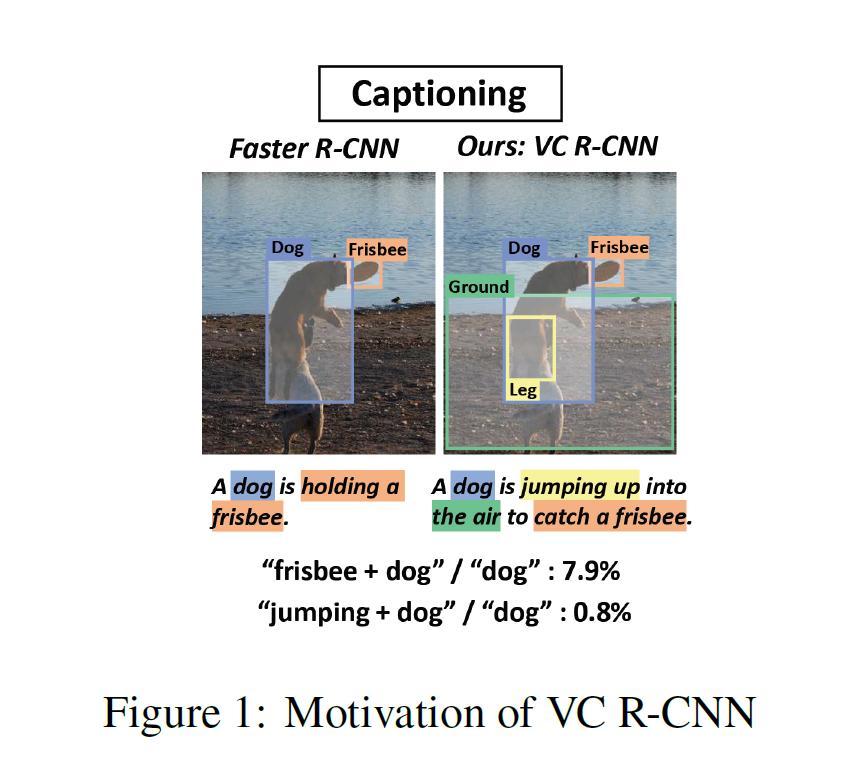
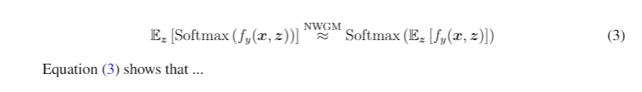
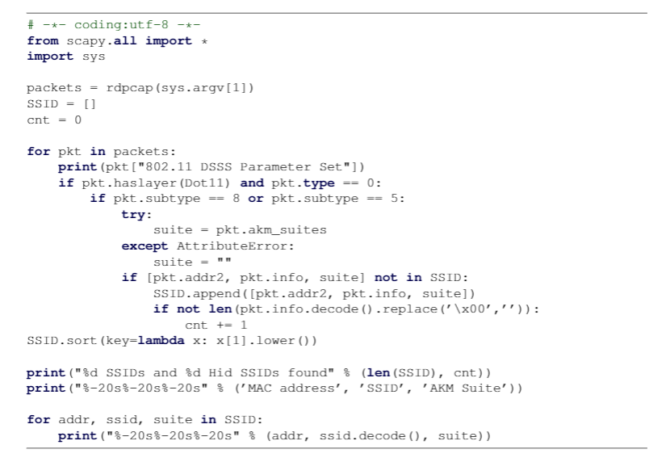
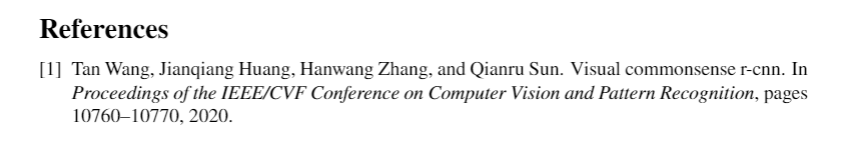
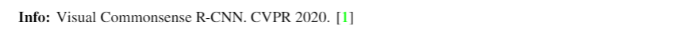

# MyLaTeX

- Only support English.
- Base on [CTAN - mcmthesis](https://www.ctan.org/pkg/mcmthesis)
- [GPL-v3.0](LICENSE)

## Use

add [`head.tex`](head.tex) at the begin of your `.tex` file.

### Content
`Content` will be automatically completed according to `section` & `subsection`.

Of course you can use `subsubsection` if you like. :)

```latex
\tableofcontents
```



### Section

Three commands are supported: `section`, `subsection` and `subsubsection`.

```latex
\section{VC R-CNN}
\subsection{Intro}
\subsubsection{Example}
```



### Figure

```latex
\begin{figure}[h]
\small
\centering
\includegraphics[width=5cm]{commense} % figures/commense.png
\caption{Motivation of VC R-CNN}
\label{fig:moti1} % You can use `\eqref{fig:moti1}` to cite this figure.
\end{figure}
```

It is easy to use this block. However, I recommand you to create a new folder named `figures`. And you can only use `commense` instead of `figures/commense.png`




### Equation

You can use both `equation` or `align` as you like.


```latex
\begin{equation}
    \mathbb{E}_{\boldsymbol{z}}\left[\operatorname{Softmax}\left(f_{y}(\boldsymbol{x}, \boldsymbol{z})\right)\right] \stackrel{\mathrm{NWGM}}{\approx} \operatorname{Softmax}\left(\mathbb{E}_{\boldsymbol{z}}\left[f_{y}(\boldsymbol{x}, \boldsymbol{z})\right]\right)
    \label{equ: nwgm} % You can use `\eqref{equ: nwgm}` to cite this equation.
\end{equation}
```



### Hyperlink
```latex
\href{https://github.com/Wangt-CN/VC-R-CNN}{https://github.com/Wangt-CN/VC-R-CNN (Pytorch)}
```


### Code 

Only six languages supported in default config:  `C, C++, Python, Java, Matlab, Mathematica`

```latex
\lstinputlisting[language=Python]{./code/base.py} 
```


### Reference

I recommand to create a `.bib` file. You can only add this at the end of the `.tex` file.

```latex
\bibliographystyle{plain}
\bibliography{ref} % .bib file name
```



Use `\cite{}` to cite it.



