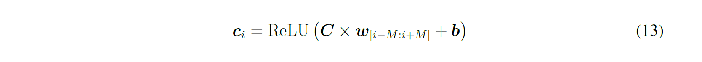

# MyLaTeX

- Only support English.
- Base on [CTAN - mcmthesis](https://www.ctan.org/pkg/mcmthesis)
- [GPL-v3.0](LICENSE)

## Install

Download this repo or copy [`bg.cls`](bg.cls) and [`head.tex`](head.tex) to your folder. Enjoy it!

```bash
git clone https://github.com/LyuLumos/MyLaTeX.git
```


## Use

Add [`head.tex`](head.tex) at the begin of your `.tex` file.

### Content
`Content` will be automatically completed according to `section` & `subsection`.

Of course you can use `subsubsection` if you like. :)

```latex
\tableofcontents
```


### Section

Three commands are supported: `section`, `subsection` and `subsubsection`.

```latex
\section{VC R-CNN}
\subsection{Intro}
\subsubsection{Example}
```

### Figure

```latex
\begin{figure}[h]
\small
\centering   
\includegraphics[width=12cm]{figures/lsmotivation.png} 
\caption{An illustrative example of long-term and short-term interests in news reading} 
\label{fig:lsmoti} % You can use `\eqref{fig:lsmoti}` to cite this figure.
\end{figure}
```

It is easy to use this block. However, I recommand you to create a new folder named `figures`. And you can only use `lsmotivation` instead of `figures/lsmotivation.png`


### Equation

You can use both `equation` or `align` as you like.


```latex
\begin{equation}
    \begin{equation}  \boldsymbol{c}_{i}=\operatorname{ReLU}\left(\boldsymbol{C} \times \boldsymbol{w}_{[i-M: i+M]}+\boldsymbol{b}\right)  \end{equation}
    \label{equ: newsencoder} % You can use `\eqref{equ: newsencoder}` to cite this equation.
\end{equation}
```



### Hyperlink
```latex
\href{https://github.com/wuch15/IJCAI2019-NAML} {https://github.com/wuch15/IJCAI2019-NAML (Tensorflow, keras)} 
```


### Item

**ordered** 

```latex
\begin{enumerate}[(1)] % You can choose `1` or `(1)`, etc.
\item ...
\item ...
\item ...
\end{enumerate}
```


**unordered**
```latex
\begin{itemize}
    \item ...
    \item ...
    \item ...
\end{itemize}
```


### Code 

Only six languages supported in default config:  `C, C++, Python, Java, Matlab, Mathematica`

```latex
\lstinputlisting[language=Python]{./code/base.py} 
```


### Reference

I recommand to create a `.bib` file. You can only add this at the end of the `.tex` file.

```latex
\bibliographystyle{plain}
\bibliography{ref} % .bib file name
```


Use `\cite{}` to cite it.


